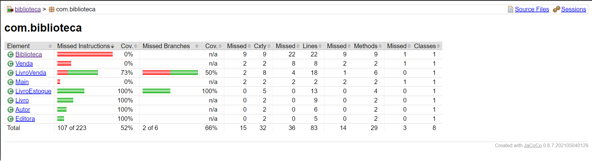
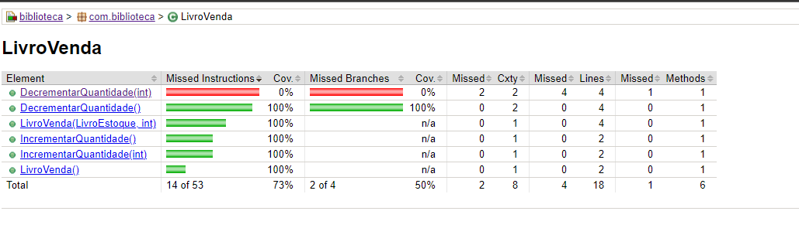
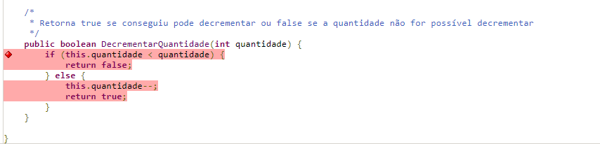

# Biblioteca
## Cobertura de Testes
Logo após configurar o JaCoCo no repositório geramos reports de cobertura de teste para conseguir comparar com evoluções nessa atividade, como colocado a seguir
### Primeiro relatório de cobertura de testes obtido

#### Exemplo 
Pelo primeiro relatório podemos verificar que dentro da classe LivroVenda a cobertura estava boa, porém um método bem importante para a regra de negócio não estava sendo coberto: o que decrementa a depender da quantidade passada via parâmetro. Incluimos um teste para ele.
 

### Útlimo relatório de cobertura de testes obtido

#### Exemplo de alteração
Classe LivroVenda aumentou sua porcentagem de cobertura de teste ao adicionarmos um teste para cobrir o método DecrementarQuantidade(int quantidade)

## É possível obter cobertura de 100%?
Acesse a reflexão sobre a pergunta no arquivo desafio-cobertura_100.txt na raiz do projeto