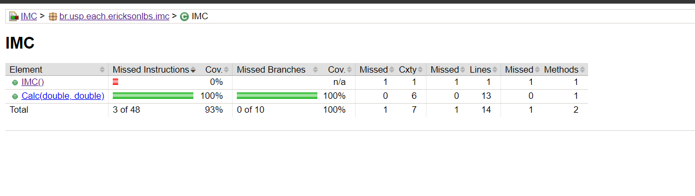

# IMC
Esse projeto tem um escopo menor do que o da biblioteca, contando apenas com 2 classes. A classe App apenas possui um método que utiliza a classe IMC, a qual já possui testes unitários criados, por isso não criamos uma classe de teste para ela.
Abaixo está o último relatório de testes obtido para o projeto IMC:

Destacamos que para a classe IMC só não há testes para o construtor padrão, sem parâmetros.
